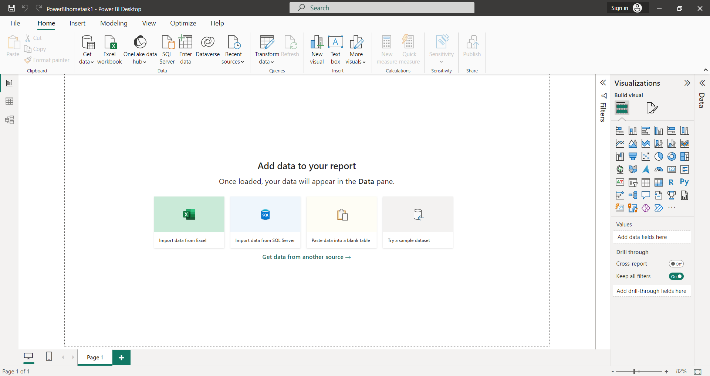

# Hometask_1 Power BI

1. 
2. Опыт в аналитике у меня был только на Фармацевтическом факультете (полтора года) и это была Аналитическая Химия 🥈(joke)
3. У меня был небольшой опыт работы в транснациональной компании в отделе R&D (research and development). Мне бы хотелось развиваться в направлении, которое позволит мне интегрироваться в современность, быть up-to-date в фармацевтической области.
4. Power BI, возможно, может быть полезным в такой должности как Medical Advisor, так же как и для обзора фармацевтического рынка; для клинических исследований, которые длятся десятилетиями, это тоже актуально, так как база данных опытов и результатов исследований очень большая, возможность оперировать накопленными данными - неотъемлемая часть эволюции продукта.
5. К основным навыкам которые мне бы хотелось освоить можно отнести навыки обработки большого объема данных, формирование релевантных отчетов, поиск конкретной и детальной информациии, создание форм для отчетности, запросов, возможность проверки автоматически создаваемых искусственным интеллектом форм отчетности или статистики, которая не допустит машинных ошибок и информация будет максимально приближена к действительности. А также, много чего еще, о чем я ещё не знаю, не имея опыта работы в данной программе.
6. У меня нет опыта работы в какой бы то ни было BI-системе
